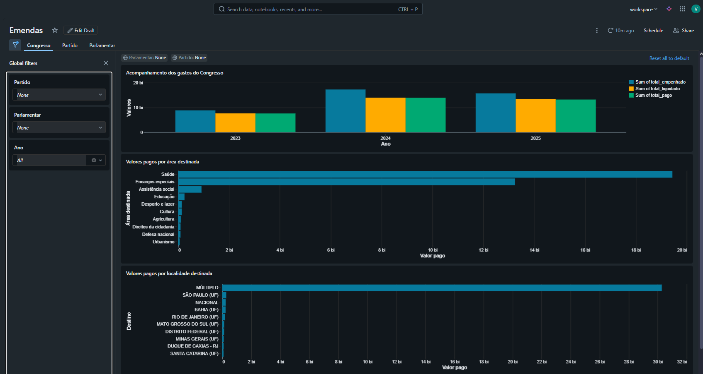
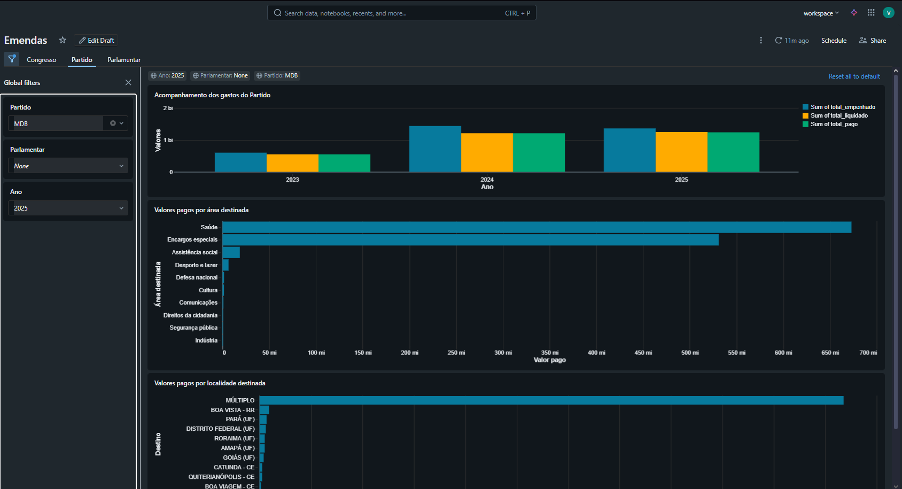
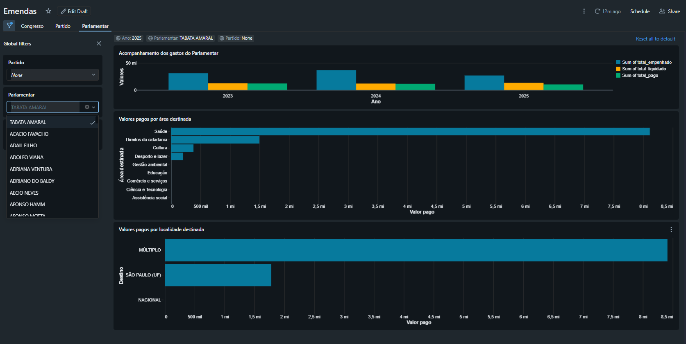

# Dashboard de Emendas Parlamentares

Este dashboard foi desenvolvido no **Databricks** com o objetivo de permitir a **análise exploratória e comparativa dos gastos com emendas parlamentares**, considerando diferentes níveis de agregação: **Congresso**, **Partido** e **Parlamentar**.

A solução permite acompanhar a execução orçamentária ao longo do tempo, analisar a destinação dos recursos por área temática e identificar os principais destinos geográficos dos valores pagos.

---

## Visão Geral do Dashboard

O dashboard é organizado em **três abas principais**, cada uma com foco analítico distinto:

* **Congresso**: visão consolidada de todos os parlamentares
* **Partido**: análise agregada por partido político
* **Parlamentar**: detalhamento individual por parlamentar

Todas as abas compartilham filtros globais, garantindo consistência na análise.

---

## Filtros Globais

Os seguintes filtros estão disponíveis em todas as abas:

* **Ano**: permite selecionar um ou mais anos de exercício
* **Partido**: filtra os dados para um partido específico
* **Parlamentar**: filtra os dados para um parlamentar específico

Os filtros são interdependentes e impactam todos os gráficos exibidos na aba selecionada.

---

## Aba: Congresso

Nesta aba é apresentada uma **visão macro dos gastos com emendas parlamentares**, considerando todo o Congresso.

### Gráficos apresentados

1. **Acompanhamento dos gastos do Congresso**
   Gráfico de barras agrupadas por ano, exibindo:

   * Valor empenhado
   * Valor liquidado
   * Valor pago

   Permite comparar a evolução da execução orçamentária ao longo do tempo.

2. **Valores pagos por área destinada**
   Gráfico de barras horizontais que mostra a distribuição dos valores pagos entre áreas como:

   * Saúde
   * Educação
   * Assistência social
   * Cultura
   * Urbanismo, entre outras

3. **Valores pagos por localidade destinada**
   Gráfico de barras horizontais destacando os principais destinos geográficos dos recursos (UFs, municípios ou categoria "Múltiplo").

---

## Aba: Partido

Esta aba permite analisar os **gastos agregados de um partido político específico**, mantendo a mesma lógica visual da aba Congresso, porém com os dados filtrados pelo partido selecionado.

### Gráficos apresentados

1. **Acompanhamento dos gastos do Partido**
   Evolução anual dos valores empenhados, liquidados e pagos pelo partido.

2. **Valores pagos por área destinada**
   Distribuição temática dos recursos do partido, permitindo identificar prioridades de alocação.

3. **Valores pagos por localidade destinada**
   Principais destinos geográficos das emendas do partido.

---

## Aba: Parlamentar

A aba de Parlamentar oferece uma **análise individualizada**, permitindo avaliar o comportamento de gasto de um parlamentar específico.

### Gráficos apresentados

1. **Acompanhamento dos gastos do Parlamentar**
   Comparação anual entre valores empenhados, liquidados e pagos.

2. **Valores pagos por área destinada**
   Evidencia as áreas temáticas prioritárias do parlamentar.

3. **Valores pagos por localidade destinada**
   Mostra os principais destinos geográficos dos recursos indicados pelo parlamentar.

---

## Considerações Técnicas

* Os valores apresentados são agregados a partir de tabelas modeladas em esquema dimensional (fato e dimensões).
* As métricas principais utilizadas no dashboard são:

  * **total_empenhado**
  * **total_liquidado**
  * **total_pago**
* O dashboard foi construído de forma a permitir reutilização das visualizações com diferentes níveis de filtro, reduzindo duplicação de lógica.

---

## Objetivo do Dashboard

Este dashboard tem como principal finalidade:

* Promover **transparência** sobre o uso de emendas parlamentares
* Facilitar análises comparativas entre anos, partidos e parlamentares
* Apoiar análises exploratórias e produção de insights sobre a destinação de recursos públicos

---

Caso novas dimensões ou métricas sejam adicionadas, o dashboard pode ser facilmente expandido mantendo a estrutura atual.
